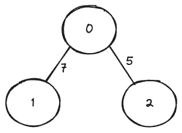

### 표현 방식

거리와 가중치는 같은말임
1. 인접 리스트 방식
	- 2차원배열로 나타내는 형식 
	- 각 index는 node임 그 값은 노드사이의 거리를 나타냄
	- 안이어졌으면 infinite
		- `import math     math.inf` 
2. 인접행렬 방식
	- 각 index를 기준으로 인접한 node의 거리를 적음
	- (node,거리)
	- `[ [(1,7),(2,5)] , [(0,7)] , [(0,5)]]` 