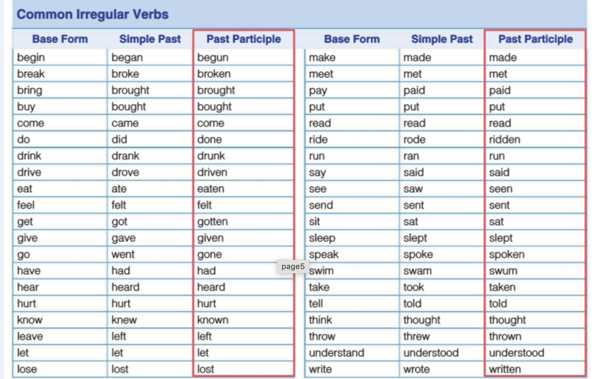

# 단어

### main
∽ 정확히 일치는아님

| 영단어            | 뜻(영문)                                                                            | 뜻(한글) |
| -------------- | --------------------------------------------------------------------------------- | ----- |
| diet           | the kind of food you usally eat                                                   |       |
| meals          | breakfast,lunch,dinner                                                            |       |
| prepare        | to make something ready                                                           |       |
| ingredients    | types of food that are combined to make a dish                                    |       |
| available      | describes something you can find or get                                           |       |
| farmers'       | people who grow and produce food                                                  |       |
| variety        | different kind of something                                                       |       |
| special        | better or more important than other things                                        |       |
| crops          | plants grown by farmers for food                                                  |       |
| dishes         | food that is cooked in a certain way                                              |       |
| customs        | most people in a certain place or culture do                                      | 관습    |
| ways           | ∽ how to do something                                                             | 방법    |
| communicate    | sharing information with                                                          |       |
| polite         | rude opposite                                                                     |       |
| connect        | ∽ when connect, feel closer                                                       |       |
| population     | all of the people who live in a certain area                                      |       |
| design         | plan how something should be                                                      |       |
| traffic        | all the vehicles moving on the roads in an area                                   |       |
| noisy          | full of loud sounds                                                               |       |
| pedestrians    | people who are walking                                                            |       |
| vehicles       | mashines, such as cars or trucks, that carry people or things from place to place |       |
| neighborhoods  | part of a city where people live                                                  | 근방    |
| transportation | all the ways of taking people or things from on place to another                  |       |
| million        | 1,000,000                                                                         |       |
| crowded        | full of people                                                                    |       |
| artery         |                                                                                   | 동맥    |
| vein           |                                                                                   | 정맥    |
| lungs          |                                                                                   | 폐     |
| muscle         |                                                                                   | 근육    |
| joint          |                                                                                   | 관절    |
| kidney         |                                                                                   | 신장    |
|                |                                                                                   |       |
|                |                                                                                   |       |
|                |                                                                                   |       |
|                |                                                                                   |       |
|                |                                                                                   |       |
|                |                                                                                   |       |
|                |                                                                                   |       |

### etc
| 영단어         | 뜻                 |
| ----------- | ------------------ |
| vegan       | 완전 채식주의            |
| vegetarian  | 주로 유재품류는 허용. 채식위주. |
| contraction | 축약형                |

# 문법

### simple present
- 습관
	- 반복됨, 
	- never, often, every, in the summer, always등과 같이 쓰임
- 일반적인 사실
### present continuous
`v-ing`
- 지금하고있는것
- now , at the moment, currently, nowadays
### simple past
- 끝난 한시점의 행동
- 정확한 과거의 시점이 나오면 무적건 이거

### present perfect
`have p.p`
- 과거서부터 현재까지 하고 있거나 현재에 영향을 끼침
- 과거에 불특정한 시간에 하거나 여러번 일어났을 경우
	- 주로 경험임
- for, since / already,yet /ever,never
- 정확한 시점이 나오면 simple past

### Simple future
`Will`
- 미래에 대한 사실
- 예측
- 미래의 행동(지금결정한.)
- before, after, when, as soon as... + simple future
	- 이때는 time clause 에는 현재형 써야함
### etc
- how are you happy how 는 걍얼마나 뿐만아니라 이유도 말해주면조음
- Linda has > Linda's 로 줄일 수 없음
- enough , not enough , too