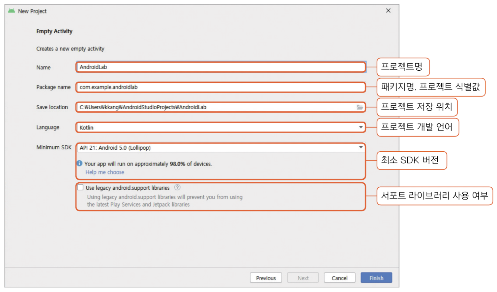
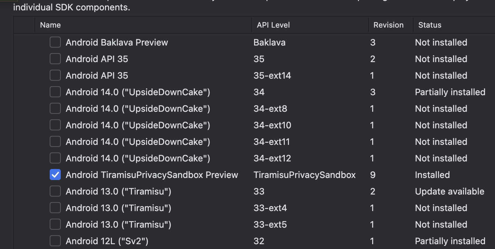
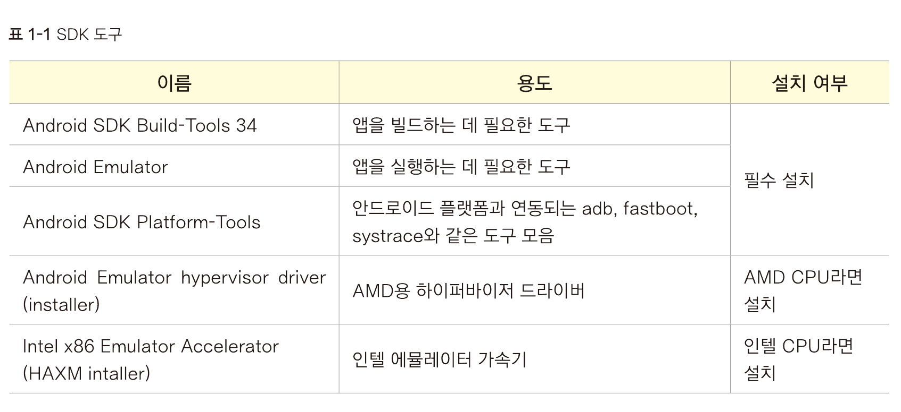
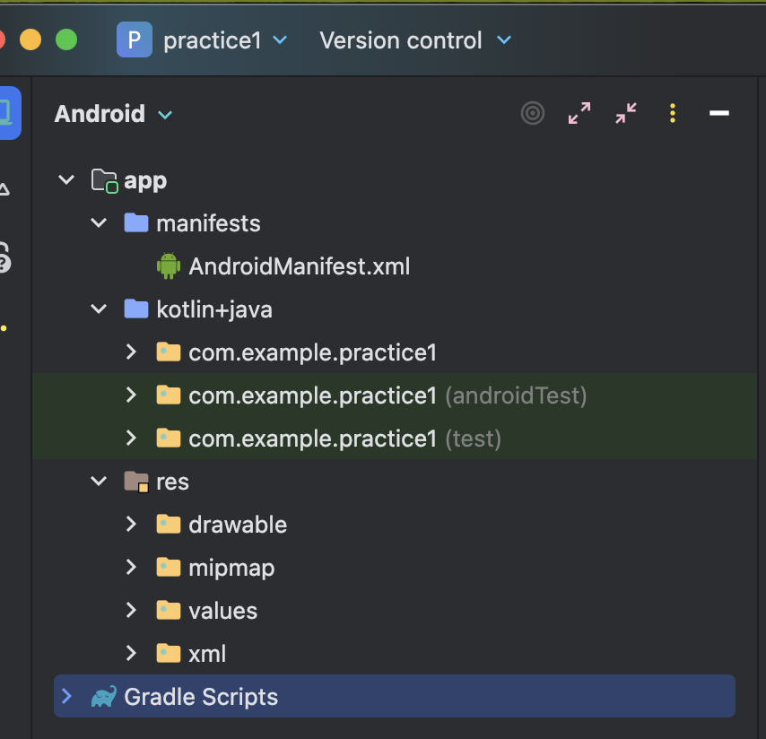

# 프로젝트 생성

- packagename : 앱의 식별값
	- 보통 도메인 역순 + ㅐ끝에 프로젝트명
- build configuration language
	- build.gradle 파일을 선택하는 부분
	- Groovy DSL과 Kotlin DSL이 있음
		- groovy : build.gradle
		- kotlin : build.gradle.kts
	- DSL가 뭔지 & 문법차이
		- https://blog.imqa.io/kotlin-dsl/
	- 장단점
		- https://kdhyo98.tistory.com/87

- `compileSdkVersion` :  일반적으로 최신 SDK 버전으로 설정하는 것이 권장됩니다.
- `targetSdkVersion` : 앱이 테스트된 최신 안드로이드 버전
- `minSdkVersion` : 앱이 지원하는 가장 낮은 안드로이드 버전

# 기타 설정
### android sdk 

- 안드로이드 개발하기 위한 툴킷
- setting > languages&framework > android sdk
- 개발 sdk는 최근 껄 하는게 좋다고한다.
	- 최신기기를 타겟팅하면서 하위호환성을 유지할 수 있다.
	- 호환성을 테스트하고자 의도적으로 낮출때도 있다.
- Android Tiramisu Privacy Sandbox Preview
	- 프라이버시기능을 특히 광고 관련쪽에서 강화한 한 버전이다

### sdk tool

# 안드로이드스튜디오 기본 폴더구성

- manifests
	- 앱의 기본설정들
	- AndriodManifest.xml : 메인 환경설정
	- `‹manifest xmlns:android="http://schemas.android.com/apk/res/android" xmlns:tools="http://schemas.android.com/tools"> `  : 루트태그
		- xmlns : xml의 네임스페이스 선언
	- `<application android:allowBackup="true" {생략}>` : 앱전체를 대상하는 설정
	- 
- kotlin+java
	- 앱 주요소스 코드 파일들
- res
	- 리소스파일
	- drawable : 이미지 백터파일
	- mipmap : 아이콘 이미지파일(주로 다양한해상도넣음)
	- value : 일반리소스들
		- strings.xml: 문자열 리소스
		- colors.xml: 색상 정의
		- themes.xml: 앱 테마 스타일
		- dimens.xml: 크기 값
		- styles.xml: 커스텀 스타일
	- xml : 환경설정, 보안, 백업등 env관련파일
	- 
- gradle script
	- gradle : 안드로이드 앱 빌드 도구
	- build.gradle.kts : 빌드 설정 script
		- `Project : AndroidLab`
			- 프로젝트 수준의 빌드 설정
		- `Module : app`
			- 모듈(앱) 수준의 빌드 설정
		- 주요코드
			- plugin : 플러그인선언
			- applicationId : 앱식별자설정
			- compileSdk : 컴파일,빌드 적용할 버전
			- minSdk, targetSdk : 최소, 타겟 SDK
			- versionCode, versionName : 버전 코드와 명
			- compileOptions, kotlinOptions : 개발언어 버전 설정
			- dependecies : 라이브러리 버전

