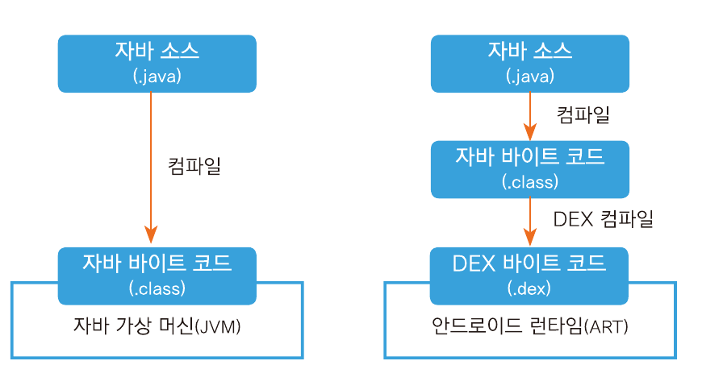

# 안드로이드

- 리눅스 기반운영체제 > 리눅스 커널 사용
- HAL(하드웨어 추상화 레이어) 
	- 자바 api프레임워크에서 하드웨어 기능을 이용할 수 있게 표준 인터페이스 제공
- ART(안드로이드 런타임)
	- 앱을 실행하는 역할
	- DEX 파일을 해석하고 실행함
		- 안드로이드 앱은 dex파일로 빌드됨
- 컴파일시
	1. 클래스 파일이 만들어짐
	2. DEX파일로 컴파일
	3. ART에서 실행
- 일반 자바코드와 안드로이드에서 자바코드 컴파일 차이
    
# 컴포넌트
- 컴포넌트가 핵심
- 앱의 구성요소 이자 구성하는 단위.
- 클래스로 컴포넌트를 개발함
- 모든 클래스가 컴포넌트는 아니고 컴포넌트 클래스가 있음
  
	- 컴포넌트클래스의 경우 클래스와 컴포넌트가 1대1대응
- 컴포넌트 클래스는 생명주기를 안드로이드 시스템에서 관리
### 종류
컴포넌트 이름 `상속받아야할 클래스 명`으로 작성
- 액티비티 `Activity`
	- 화면 구성하는 컴포넌트
- 서비스 `Service`
	- 백그라운드 작업을 하는 컴포넌트
- 콘텐츠 프로바이드 `ContentProvider`
	- 앱데이터 공유하는 컴포넌트
	- 앱간에 데이터를 공유할 수도 있음.
- 브로드캐스트 리시버 `BroadcastReceiver`
	- 시스템 이벤트가 발생할때 실행되게하는 컴포넌트

# 개발시 특징

#### 다른 앱을 라이브러리처럼 사용가능
#### 리소스
- 리소스 : 정적인 값
- 안드로이드는 이를 리소스로 등록해서 사용
- 대부분 리소스는 xml파일로 작성한다.
- 리소스로 등록
- res 바로아래의 하위폴더는 정해져있다.
	- R자바파일에 파일명기준으로 식별하는 int 형 변수가자동으로 만들어짐
	- 리소스 유형들
	- https://developer.android.com/guide/topics/resources/providing-resources?hl=ko
- 파일명은 자바의 규칙을 따름 자바는 snake_case 사용
	- 파일명에 대문자 ㄴㄴ
  ``` xml
	<string name="mytxt">
		동해 물과 백두산이 마르고 닳도록
	</string>
	```
- 리소스 접근
	- `resources.getString(R.string.mytxt)`
- 장점
	- 유지보수성 향상
		- 리소스를 외부화하면 코드와 데이터를 분리할 수 있어 유지보수가 용이해집니다. 예를 들어, 문자열을 strings.xml 파일에 저장하면 애플리케이션 코드를 수정하지 않고도 텍스트를 쉽게 변경할 수 있습니다.
	- 다국어 지원 용이성
		- 리소스 파일을 사용하면 다국어 지원이 매우 간단해집니다. 각 언어별로 별도의 문자열 리소스 파일을 만들어 사용자의 언어 설정에 따라 적절한 텍스트를 자동으로 표시할 수 있습니다.
	- 일관성 유지
		- 중앙 집중식으로 리소스를 관리하면 앱 전체에서 일관된 스타일과 데이터를 유지하기 쉽습니다. 예를 들어, 색상이나 크기 값을 리소스로 정의하면 여러 곳에서 동일한 값을 쉽게 재사용할 수 있습니다.
	- 디자인 변경 용이성
		- UI 요소를 XML 레이아웃 파일로 정의하면 코드를 수정하지 않고도 디자인을 쉽게 변경할 수 있습니다. 이는 디자이너와 개발자 간의 협업을 원활하게 합니다.
	- 리소스 최적화
		- 안드로이드 시스템은 리소스를 효율적으로 관리하고 최적화합니다. 예를 들어, 기기 구성에 가장 적합한 리소스를 자동으로 선택하여 로드합니다.
	- 메모리 관리 개선
		- 정적 변수와 달리 리소스는 시스템에 의해 더 효율적으로 관리됩니다. 이는 메모리 누수 위험을 줄이고 앱의 안정성을 향상시킵니다.
