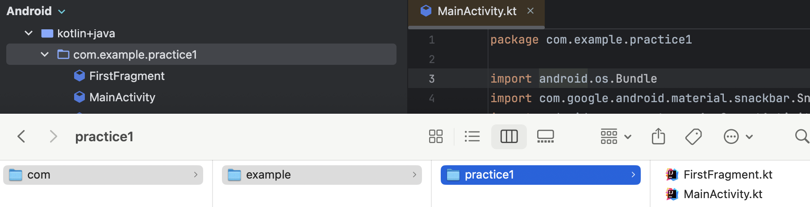

# 특징
- 상호 운용성
	- java와 100% 호환됨
- Null safety
	- null허용과 null 불허용을 구분하여 선언함
- java에 비해 간결함
- 구조화 동시성
	- 코루틴을 이용한 비동기 프로그래밍 간소화

# 파일구성
- 코틀린에서는 하위폴더를 .으로 구분됨
### 패키지란...
- package는 이파일을 컴파일 했을때 만들어지는 클래스 파일위치를 나타냄
- 일반적으로 kt파일의 위치와 package이름을 동일시
	- 다르게할수도있음.
- 같은 패키지에있는 변수,함수와 클래스는 import 하지않아도됨