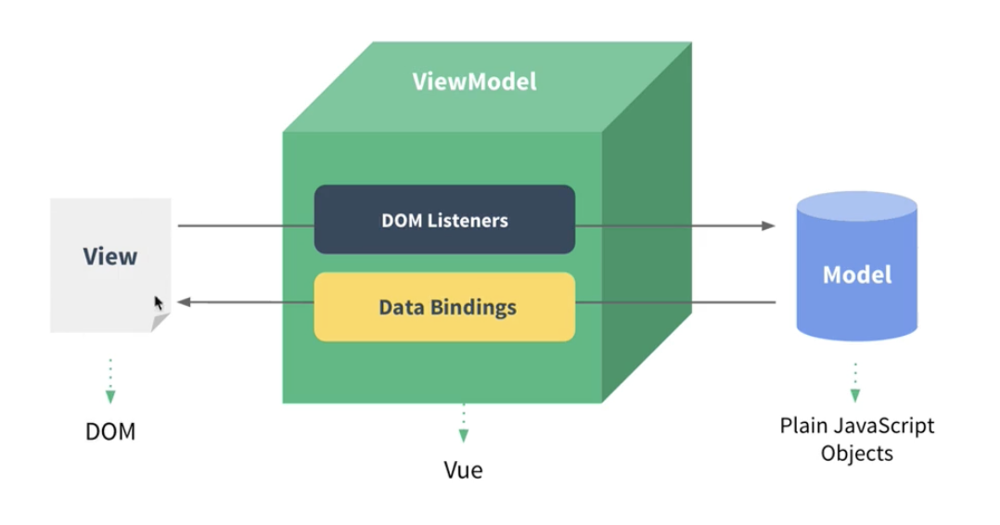
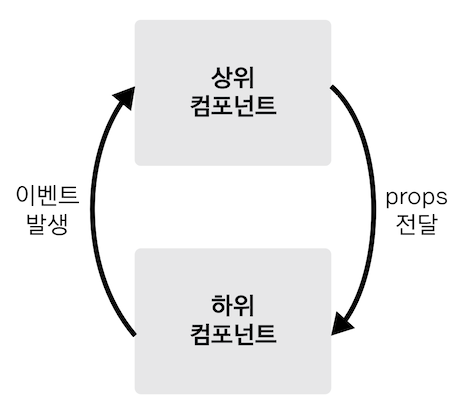

MVVM 패턴

가상돔 이동

## 주요 개념
### reactivity. 반응성
데이터 바인딩 감지 > 리액트에도 잇음~
Object.defineProperty
오..님천재임? 
즉시실행함수를 이용하여 스코프 관리

### 뷰 컴포넌트
컴포넌트 기반으로 관리 - 재사용성
## 기본 문법
data = react의 state같은거
변화를 감지해서 화면에 렌더링함
### 인스턴스 생성
```
let vm = new Vue({
	el: "#app", //인스턴스 그려지는 시작점
	data : {
		message : "hi"
	},
	template:,// 화면에 표시할 요소
	methods:, 화면의 동작과 이벤트 로직을 제어하는 메서드
	created:,// lifecycles관련 속성
	watch: , 	//data정의 속성 변화햇을때 추가동작 (useEffect같은거군.)
	components:,//지역컴포넌트 등록
})  // 관습적으로 vm사용 
```

### 컴포넌트
####  생성
```js
// 전역 컴포넌트로 등록
Vue.component(
	'app-header',
	{
		template: '<h1></h1>'
	}
)
// 지역컴포넌트 등록방법
new Vue({
	el :"#app",
	components : {
		'컴포넌트 이름' : {컴포넌트 내용}
	}
})

```
사용할때는 컴포넌트 등록 이름을 이용하여 사용하면 됨
`<app-header/>` 
#### 통신

리액트랑 같음

### 속성 문법
#### props 전달
동적 할당
```js 
<tag  v-bind:propsname = "변수이름"/>
<tag  :propsname = "변수이"/>
//위에 두개는 같다.
var tag  = {
	template: '<h1>tag</h1>',
	props : ['propsname']
}
new Vue({
	el :"#app",
	components : {
		'tag' : tag
	},
	data:{
		varname
	}
})
```

#### 이벤트
```js
//click
var tag  = {
	template: '<button v-on:click>click me</button>',
	props : ['propsname']
}
```
## React와 차이점, 같은점

데이터흐름 양방향 vs 단방향
장단점

https://velog.io/@injoon2019/%EB%AA%85%EB%A0%B9%ED%98%95-vs-%EC%84%A0%EC%96%B8%ED%98%95-%ED%95%A8%EC%88%98%ED%98%95


>https://gymcoding.notion.site/acf439e5e4b04e079104439153a7f223
>https://joshua1988.github.io/vue-camp/
>+ 검색자료