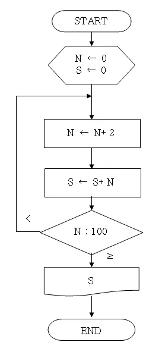
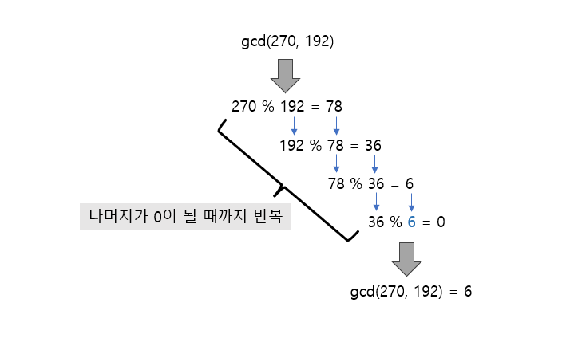
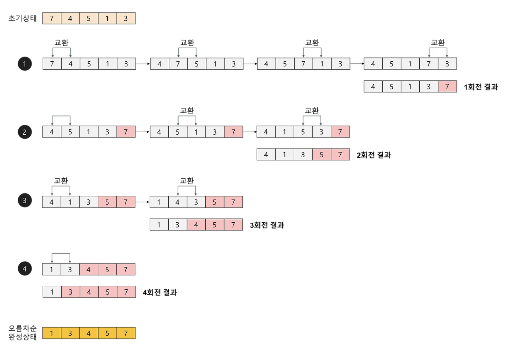

#### 순서도


### 뉴클리드 호재법
두 수의 최대공약수를 구할 때
나머지가 0이될때 나누는 값이(작은 값이) 최대공약수
 
최소공배수는 걍 두수곱하고 최대공약수로 나눠주면됨ㅇㅇ

### 에라토스테네스의 체
소수 판별

```c
// 1. 배열을 생성하여 초기화한다.
for(int i=2;i<=number;i++) {
	a[i] = i;
}

// 2. 2부터 시작해서 특정 수의 배수에 해당하는 수를 모두 지운다.
// (지울 때 자기자신은 지우지 않고, 이미 지워진 수는 건너뛴다.)
for(int i=2;i<=number;i++) {
	if(a[i]==0) continue; // 이미 지워진 수라면 건너뛰기

	// 이미 지워진 숫자가 아니라면, 그 배수부터 출발하여, 가능한 모든 숫자 지우기
	for(int j=2*i;j<=number; j+=i) {
		a[j] = 0;
	}
}

// 3. 2부터 시작하여 남아있는 수를 모두 출력한다.
for(int i=2;i<=number;i++) {
	if(a[i]!=0) printf("%d ", a[i]);
}

```

### 정렬
#### 버블

```c
// O(n^2)
void bubble_sort(int list[], int n){ 
	int i, j, temp; 
	for(i=n-1; i>0; i--){//정렬크기보다 하나작게 반복
		for(j=0; j<i; j++){ // j번째와 j+1번째의 요소가 크기 순이 아니면 교환 
			if(list[j]<list[j+1]){ 
				temp = list[j]; 
				list[j] = list[j+1]; 
				list[j+1] = temp; 
			 }
		} 
	} 
}
```
결과가 뒤에서부터 확립되는... 결과적으로 최댓값탐색
#### 선택
최소값탐색 > 현재나랑 스왑
```c
// 선택 정렬
void selection_sort(int list[], int n){
	int i, j, least, temp;
	
	// 마지막 숫자는 자동으로 정렬되기 때문에 (숫자 개수-1) 만큼 반복한다.
	for(i=0; i<n-1; i++){
		least = i;

		// 최솟값을 탐색한다.
		for(j=i+1; j<n; j++){
		if(list[j]<list[least])
			least = j;
		}
		
		// 최솟값이 자기 자신이면 자료 이동을 하지 않는다.
		if(i != least){
			SWAP(list[i], list[least], temp);
		}
	}
}
```
https://wing-beat.tistory.com/18
https://hyo-ue4study.tistory.com/68
버블, 선택, 삽입

### 검색
이진검색
